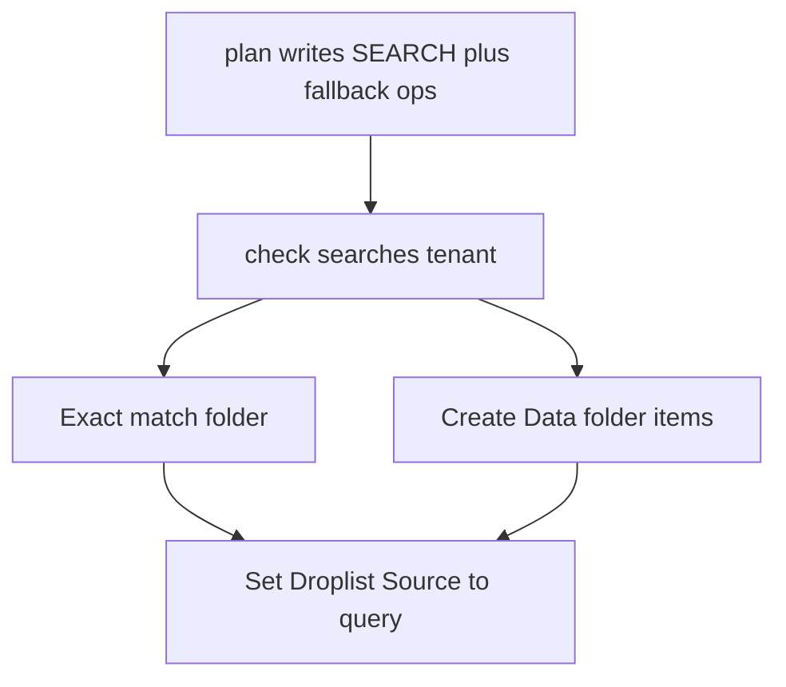

---
name: Droplist query sources
overview: Keep Droplist fields for spec-driven selections such as Theme, but write Source as a Sitecore query that points at option items. Reuse a matching collection in the tenant when one exists; otherwise create a Data-folder datasource. Do not switch the field type to Enum or Droplink.
todos:
  - id: manifest-option-source
    content: Add optionSource + defaultValue validation (xor with source; Folder fallback path required)
    status: completed
  - id: plan-search-ops
    content: "Emit SEARCH_ITEMS, resolveOptionSource, fallback creates, query: Source, Standard Values default"
    status: completed
  - id: executor-reuse-create
    content: Search tenant, exact name/displayName match, create Data folder items add-only, check is read-only
    status: completed
  - id: tsx-droplist
    content: Map Droplist to Field<string> in type-map + emitter
    status: completed
  - id: tests-goldens-docs
    content: Executor/validate tests, regenerate goldens if needed, skill/wiki/graph
    status: in_progress
  - id: image-cta-check
    content: Update Image CTA Row manifest, plan + check; wait for push gate
    status: pending
isProject: false
---

# Droplist sources via Sitecore query

The live Image CTA Row `theme` field failed because Sitecore Droplist Source is not a `name=Value` list. It must be a path or a Sitecore query that selects items ([general query syntax](https://doc.sitecore.com/xp/en/developers/105/sitecore-experience-manager/general-query-syntax.html)). Droplist still stores the **item name** (`light` / `dark`); Display Name is what authors see (`Light` / `Dark`).

Do **not** change `sitecoreType` to Enum or Droplink. Do **not** use SXA `Enum` / `Enums` templates.



## Manifest

Add an optional `optionSource` on a field (mutually exclusive with a raw `source` string). Example for Theme:

```json
{
  "name": "theme",
  "title": "Theme",
  "sitecoreType": "Droplist",
  "required": true,
  "defaultValue": "light",
  "optionSource": {
    "searchRoot": "/sitecore/content/Training App Router",
    "options": [
      { "name": "light", "displayName": "Light" },
      { "name": "dark", "displayName": "Dark" }
    ],
    "fallback": {
      "path": "/sitecore/content/Training App Router/Basic Site/Data/Enumerations/Image CTA Row/Theme"
    }
  }
}
```

- `searchRoot` is the tenant content root (user choice: search the whole tenant).
- `options[].name` is the stored Droplist value and the item name.
- `options[].displayName` is `__Display name`.
- `fallback.path` is required and explicit (user choice: always under site `Data`). No guessed parent.
- Folder template for created parents: `/sitecore/templates/Common/Folder`. Option items: same Folder template (name-only list is enough for Droplist). Do not create an Enum template or a `Value` field unless the spec later requires it.
- Validate: unique names, `defaultValue` is one of the names, `source` xor `optionSource`, absolute `/sitecore/` paths.

Skill import: when a spec says Droplist values like `light=Light`, draft `optionSource` and ask for `searchRoot` + `fallback.path`. Never write `light=Light` into Source.

## Plan artifact ([src/build-plan.cjs](src/build-plan.cjs))

Keep `plan` offline and deterministic. Embed GraphQL (no GUIDs):

- Existing `ITEM_BY_PATH` / `CREATE_ITEM` / `UPDATE_ITEM`.
- New `SEARCH_ITEMS` using Authoring `search` with `_template` + `_path` (already proven live).

New ops **before** `configureField` for that field:

1. `resolveOptionSource` — describes search + exact-match rule; binds `__OPTION_SOURCE_PATH__`.
2. Conditional create-folder / create-option-item ops for the fallback path (add-only).
3. `configureField` writes `Source` as the Sitecore query string, not a placeholder GUID.

Query written to Source (from the Sitecore docs: `/`, `*`, `#` for dashes, `query:` prefix for field Source):

```text
query:<resolvedFolder>/*
```

If the folder name has dashes, escape with `#` as in the docs (`#meta-data#`).

If `defaultValue` is set, ensure `__Standard Values` and set that field to the option **name** (e.g. `light`).

## Executor ([src/executor.cjs](src/executor.cjs))

On `check` / `push`:

1. Resolve `searchRoot` and paginate `search` under that ancestor.
2. Group candidate children by parent folder.
3. **Reuse** only if a folder’s children match the option set exactly by **item name** (case-insensitive) and **displayName**. Extra or missing children → not a match.
4. Multiple exact matches → conflict, list paths, do not pick.
5. No match → create missing segments under `fallback.path` with Folder template; create missing option items; never delete extras on an existing fallback folder (report extras as follow-ups; still point Source there only if required names exist or were added).
6. Bind Source to `query:<path>/*`.
7. `check` must issue zero mutations.

Do not reuse Facebook comments Light/Dark: names are `Light`/`Dark`, not `light`/`dark`, and they live outside a matching folder contract.

## Image CTA Row follow-up

Update [artifacts/image-cta-row.manifest.json](artifacts/image-cta-row.manifest.json): drop the invalid Source string; add `optionSource` + `defaultValue`. Regenerating the plan is CLI-only.

Expected `check` after implementation: create `.../Data/Enumerations/Image CTA Row/Theme` with `light` and `dark`, then rewrite Theme Source to `query:.../Theme/*`. No push until a new in-session gate.

## Tests and docs

- Validator cases in [test/validate.test.cjs](test/validate.test.cjs).
- Fake CMS in [test/helpers.cjs](test/helpers.cjs) must handle `search` and Folder creates.
- Executor cases: reuse, tenant scope, mismatch, fallback create, extras, multi-match conflict, check-no-mutate, defaultValue, secrets never logged.
- Regenerating goldens with the tool if planner JSON shape changes ([CONTRIBUTING.md](CONTRIBUTING.md)).
- Docs: [SKILL.md](skills/provision-sitecore-ai-component/SKILL.md), [confluence-import.md](skills/provision-sitecore-ai-component/references/confluence-import.md), [authoring-api.md](skills/provision-sitecore-ai-component/references/authoring-api.md), [manifest-contract.md](skills/provision-sitecore-ai-component/references/manifest-contract.md), [type-mapping.md](skills/provision-sitecore-ai-component/references/type-mapping.md) (Droplist → `Field<string>` in [src/type-map.cjs](src/type-map.cjs)).
- Wiki journal + topic Decision; `pnpm graph:build`; `pnpm test`.
